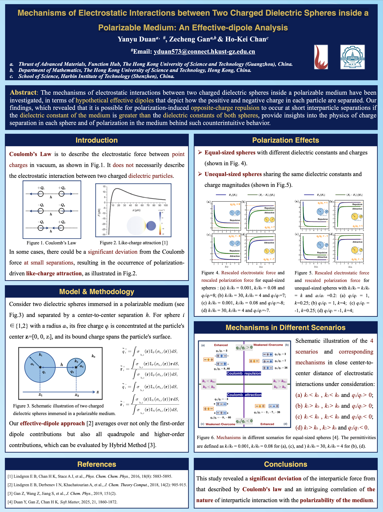

## 总结

**在此海报前观看讨论5分钟**

### 对话总结

用户询问关于一张涉及“Mechanisms of Electrostatic Interactions between Two Charged Dielectric Spheres inside a Polarizable Medium”主题的学术海报的关键内容及主要观点是什么？

AI回应：
这是一张详细的科学论文海报，主要内容是探究两带电介质球体在可极化介质内的静电相互作用机制。它基于假设的有效偶极子概念解释了正负电荷分离情况，并特别提到若介质介电常数高于两者各自值时可能出现意外行为——即短距离间隔处产生的极化驱动同种电荷吸引效应。此外还展示了不同尺寸、介电特性差异以及电量相等情况下的复现电磁力变化趋势曲线及相关物理场景示意图。最后得出重要结论为实际间的力与库伦定律有显著偏移且其本质受媒介极性的影响密切联系着这一复杂过程背后的微观物理学原理。

## 记录

**用户**: 简述海报

**AI**: 该海报探讨了两带电介质球体之间静电相互作用的机制，在可极化介质中的有效偶极子分析框架下进行了研究。

**摘要：**
- 研究发现如果介电常数大于两种粒子各自的介电常数，则可能产生由极化引起的相反电荷排斥现象。
  
**引言部分讨论了库仑定律和一些特殊情况下的显著偏差导致的现象（如图2所示）**

**模型与方法论中描述了一个理论模型来模拟这种情形: 通过考虑不同大小、相同或不同的介电常数值以及等量异号电荷分布的情况来进行计算。具体包括对小间距内出现反向吸引力的研究结果展示于图表3至6之中；同时介绍了如何利用混合法评估高阶贡献项的方法学细节。**

**结论指出此研究表明从Coulomb法则预测到的实际力存在明显偏离, 并揭示出中介质极性性质与其间交互方式之间的关联规律。”

**用户**: 一句话

**AI**: 这张海报详细阐述了两带电介质球体内在可极化介质中的静电相互作用机理及其影响因素。

