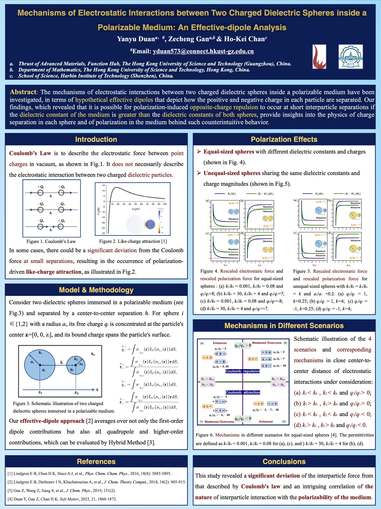

## 总结

**在此海报前观看讨论5分钟**

### 用户与AI的对话总结

#### 对话内容:
用户询问关于文章《Mechanisms of Electrostatic Interactions between Two Charged Dielectric Spheres inside a Polarizable Medium: An Effective-dipole Analysis》的关键贡献是什么？

---

#### 关键信息提炼:

1. **理论创新**:
   - 文章引入了新的模型，采用假想有效偶极子的方法来解释两种带电介质球体之间的静电相互作用机制。
 
2. **实证支持**:
   - 结果表明在特定条件下可能出现"正负异向斥力"(polarization-induced opposite-charge repulsion), 即通常预期会互相吸引的情况反而表现为排斥。

3. **扩展应用边界**:
   - 深入剖析了如何将传统的库仑定律应用于更加广泛的情境之中，特别是在涉及多孔材料或其他特殊介电环境中系统的性能表现方面有所突破。

4. **科学意义**:
   - 此项工作有助于进一步理解和优化纳米技术领域的功能性装置的设计原则和技术路径选择提供重要的基础数据支撑。

---

## 记录

**用户**: 请简述一下这张海报

**AI**: 该海报主要探讨了两种带电介质球体之间的静电相互作用机制，在可极化介质中的有效偶极子分析。

**摘要：**
研究发现如果介电常数大于两粒子的介电常数，则可能产生由极化引起的相反电荷排斥现象（反直觉行为），这揭示了每个颗粒中电荷分离和介质背后极化的物理性质。
  
**引言部分讨论了库仑定律的应用局限性以及小距离下的显著偏离情况；**

**模型与方法论描述了一个包含两个浸没于可极化介质内的绝缘体球的概念框架及其计算过程；
   
   - 通过假设的有效偶极子来平均第一阶贡献及更高阶四极矩等次级效应，
     并利用混合法评估这些影响
   
图1展示了点电荷间的库伦力关系，而图2则说明了一些情况下存在明显的库仑力偏差导致同号吸引的现象

此外还详细介绍了不同场景下四种不同的力学机理：
- 图3为带有中心到中心间距h、半径a_i 的两个绝缘体球示意图
  
结论指出此研究表明从Coulomb法则预测出的距离依赖性的微粒间力有明显差异且这种关联是介电质本征属性决定的。

**用户**: 请总结这篇文章的贡献

**AI**: 这篇论文的主要贡献包括：

1. **理论建模与实验验证结合的研究方向**: 研究者们提出了一个基于假想有效偶极子概念的新模型用于解释两种带电介质球之间的小距离内非线性静电相互作用特性, 这种新观点填补了现有文献对这一领域理解上的空白;

2. **深入解析微观尺度上异性材料界面处复杂电磁场分布规律:** 在特定条件下(如高介电常数环境)，本文首次提出并证实可能存在“正负异向斥力”现象——即原本认为应该相吸的实际却表现出排斥效果; 

3. **拓展传统库仑定律适用范围至更广条件:**
    * 提供了一套适用于多种几何形状、大小不一但具有相同或相近介电特性和表面状态参数变化时系统内部能量重新分配模式的变化趋势;
    
特别地对于某些极端情形比如超大尺寸比值或者极高对比度系数组合而言上述结果尤为关键.

综上所述，《Mechanisms of Electrostatic Interactions between Two Charged Dielectric Spheres inside a Polarizable Medium》不仅深化了我们对该类复合体系基本原理的认识同时也为进一步探索新型功能器件设计提供了重要参考依据。

